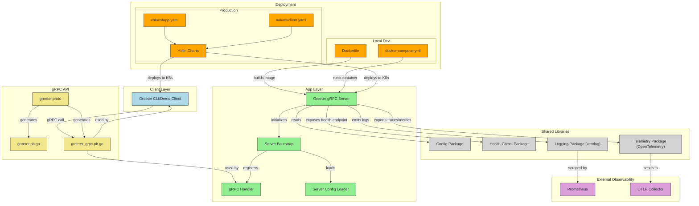

```mermaid
flowchart TD
    %% Client Layer
    subgraph "Client Layer"
        direction TB
        Client["Greeter CLI/Demo Client"]:::client
    end

    %% API Definition
    subgraph "gRPC API"
        direction TB
        Proto["greeter.proto"]:::api
        Stubs1["greeter.pb.go"]:::api
        Stubs2["greeter_grpc.pb.go"]:::api
    end

    %% App Layer
    subgraph "App Layer"
        direction TB
        Server["Greeter gRPC Server"]:::server
        Bootstrap["Server Bootstrap"]:::server
        Handler["gRPC Handler"]:::server
        ConfigLoader["Server Config Loader"]:::server
    end

    %% Shared Libraries
    subgraph "Shared Libraries"
        direction TB
        ConfigPkg["Config Package"]:::shared
        Healthz["Health-Check Package"]:::shared
        Logging["Logging Package (zerolog)"]:::shared
        Telemetry["Telemetry Package (OpenTelemetry)"]:::shared
    end

    %% Deployment
    subgraph "Deployment"
        direction TB
        subgraph "Local Dev" 
            direction TB
            Dockerfile["Dockerfile"]:::infra
            Compose["docker-compose.yml"]:::infra
        end
        subgraph "Production"
            direction TB
            HelmChart["Helm Charts"]:::infra
            ValuesApp["values/app.yaml"]:::infra
            ValuesClient["values/client.yaml"]:::infra
        end
    end

    %% External Observability
    subgraph "External Observability"
        direction TB
        Prometheus["Prometheus"]:::external
        OTLP["OTLP Collector"]:::external
    end

    %% Connections
    Client -->|gRPC call| Stubs2
    Proto -->|generates| Stubs1
    Proto -->|generates| Stubs2
    Stubs2 -->|used by| Handler
    Stubs2 -->|used by| Client
    Server -->|initializes| Bootstrap
    Bootstrap -->|registers| Handler
    Bootstrap -->|loads| ConfigLoader
    Server -->|reads| ConfigPkg
    Server -->|emits logs| Logging
    Server -->|exports traces/metrics| Telemetry
    Server -->|exposes health endpoint| Healthz
    Telemetry -.->|sends to| OTLP
    Logging -.->|scraped by| Prometheus

    Dockerfile -->|builds image| Server
    Compose -->|runs container| Server
    HelmChart -->|deploys to K8s| Server
    HelmChart -->|deploys to K8s| Client
    ValuesApp --> HelmChart
    ValuesClient --> HelmChart

    %% Click Events
    click Proto "https://github.com/highonsemicolon/aura/blob/main/apis/greeter/proto/greeter.proto"
    click Stubs1 "https://github.com/highonsemicolon/aura/blob/main/apis/greeter/gen/greeter.pb.go"
    click Stubs2 "https://github.com/highonsemicolon/aura/blob/main/apis/greeter/gen/greeter_grpc.pb.go"
    click Server "https://github.com/highonsemicolon/aura/blob/main/services/app/main.go"
    click Bootstrap "https://github.com/highonsemicolon/aura/blob/main/services/app/internal/server/server.go"
    click Handler "https://github.com/highonsemicolon/aura/blob/main/services/app/internal/handler/greeter.go"
    click ConfigLoader "https://github.com/highonsemicolon/aura/blob/main/services/app/internal/config/config.go"
    click Client "https://github.com/highonsemicolon/aura/blob/main/services/client/main.go"
    click ConfigPkg "https://github.com/highonsemicolon/aura/blob/main/pkg/config/config.go"
    click Healthz "https://github.com/highonsemicolon/aura/blob/main/pkg/healthz/healthz.go"
    click Logging "https://github.com/highonsemicolon/aura/blob/main/pkg/logging/logging.go"
    click Telemetry "https://github.com/highonsemicolon/aura/blob/main/pkg/telemetry/telemetry.go"
    click Dockerfile "https://github.com/highonsemicolon/aura/tree/main/Dockerfile"
    click Compose "https://github.com/highonsemicolon/aura/blob/main/docker-compose.yml"
    click HelmChart "https://github.com/highonsemicolon/aura/tree/main/helm/"
    click ValuesApp "https://github.com/highonsemicolon/aura/blob/main/helm/values/app.yaml"
    click ValuesClient "https://github.com/highonsemicolon/aura/blob/main/helm/values/client.yaml"

    %% Styles
    classDef client fill:#add8e6,stroke:#333,stroke-width:1px
    classDef server fill:#90ee90,stroke:#333,stroke-width:1px
    classDef shared fill:#d3d3d3,stroke:#333,stroke-width:1px
    classDef infra fill:#ffa500,stroke:#333,stroke-width:1px
    classDef external fill:#dda0dd,stroke:#333,stroke-width:1px
    classDef api fill:#f0e68c,stroke:#333,stroke-width:1px


```